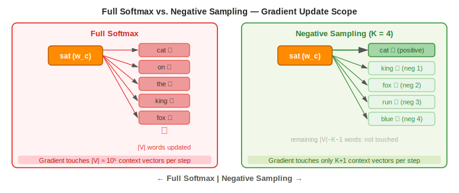
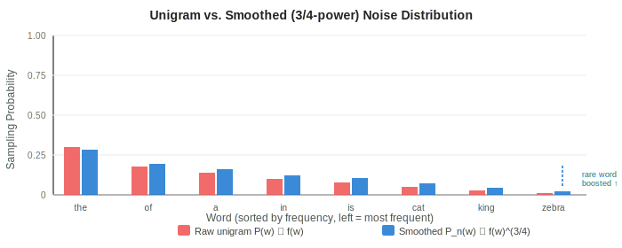

# Negative Sampling in Word2Vec

> **Core idea:** Replace the expensive full-vocabulary softmax with a binary classification task — tell real context words apart from randomly sampled noise words.  
> **Why it matters:** Reduces per-step gradient cost from $O(|V|)$ to $O(K)$, making Word2Vec training feasible on billion-word corpora.  
> **Key insight:** You don't need a proper probability distribution at each step — you only need the embeddings to move in the right direction.

---

## 1. The Problem: Softmax Is Too Slow

### 1.1 Full Softmax Recap

In the original Skip-Gram model, the probability of a context word $w_o$ given a center word $w_c$ is:

$$
P(w_o \mid w_c) = \frac{\exp\!\left(\mathbf{u}_{w_o}^\top \mathbf{v}_{w_c}\right)}{\displaystyle\sum_{w \in V} \exp\!\left(\mathbf{u}_w^\top \mathbf{v}_{w_c}\right)}
$$

The denominator — the **partition function** $Z$ — requires computing a dot product and an exponential for **every word in the vocabulary** at every gradient step:

$$
Z = \sum_{w \in V} \exp\!\left(\mathbf{u}_w^\top \mathbf{v}_{w_c}\right)
$$

### 1.2 Cost Analysis

| Quantity | Value |
|---|---|
| Vocabulary size $\vert V \vert$ | $\sim 10^5$ |
| Training pairs per epoch | $\sim 10^8$–$10^9$ |
| Dot products per step (full softmax) | $\vert V \vert \approx 100{,}000$ |
| Dot products per step (Neg. Sampling, $K=5$) | $K + 1 = 6$ |
| Approximate speedup | $\sim 10{,}000\times$ |

The gradient update for full softmax must propagate through all $|V|$ context vectors $\mathbf{u}_w$. Negative Sampling limits this to $K+1$ vectors.

---

## 2. Reformulating as Binary Classification

### 2.1 Core Idea

Instead of asking *"which word out of |V| is the correct context?"*, Negative Sampling asks a simpler question for each candidate word:

> *"Is this word a real context of $w_c$, or is it noise?"*

This converts the multi-class problem (softmax over $|V|$ classes) into $K+1$ **independent binary logistic regression** problems.

### 2.2 Positive and Negative Examples

For each training pair $(w_c, w_o)$ drawn from the corpus:

- **Positive example** $(w_c, w_o, y=1)$: $w_o$ genuinely co-occurs with $w_c$ in the window.
- **Negative examples** $(w_c, w_k, y=0)$: $K$ words $w_1, \dots, w_K$ sampled at random from the **noise distribution** $P_n(w)$.

### 2.3 The Binary Classifier

The model predicts the probability that a pair $(w_c, w)$ is real using the sigmoid of their dot product:

$$
P(y = 1 \mid w_c, w) = \sigma\!\left(\mathbf{u}_w^\top \mathbf{v}_{w_c}\right) = \frac{1}{1 + e^{-\mathbf{u}_w^\top \mathbf{v}_{w_c}}}
$$

A high dot product → the model believes $w$ is a genuine context of $w_c$.  
A low dot product → the model believes $w$ is noise.

---

## 3. Objective Function

### 3.1 NEG Loss for One Training Pair

For center word $w_c$, positive context $w_o$, and $K$ negatives $w_1, \dots, w_K$:

$$
\boxed{J_\text{NEG}(w_c, w_o) = -\log \sigma\!\left(\mathbf{u}_{w_o}^\top \mathbf{v}_{w_c}\right) - \sum_{k=1}^{K} \log \sigma\!\left(-\mathbf{u}_{w_k}^\top \mathbf{v}_{w_c}\right)}
$$

**Term-by-term interpretation:**

| Term | Goal |
|---|---|
| $-\log \sigma(\mathbf{u}_{w_o}^\top \mathbf{v}_{w_c})$ | Maximize score for the true context → push $\mathbf{u}_{w_o}$ and $\mathbf{v}_{w_c}$ closer |
| $-\log \sigma(-\mathbf{u}_{w_k}^\top \mathbf{v}_{w_c})$ | Minimize score for each noise word → push $\mathbf{u}_{w_k}$ and $\mathbf{v}_{w_c}$ apart |

Note: $\sigma(-x) = 1 - \sigma(x)$, so minimizing $-\log \sigma(-z)$ is equivalent to maximizing the probability that the noise word is classified as noise.

### 3.2 Full Training Objective

Summing over all training pairs in the corpus:

$$
J = -\frac{1}{T} \sum_{t=1}^{T} \sum_{\substack{-m \leq j \leq m \\ j \neq 0}} \left[ \log \sigma\!\left(\mathbf{u}_{w_{t+j}}^\top \mathbf{v}_{w_t}\right) + \sum_{k=1}^{K} \log \sigma\!\left(-\mathbf{u}_{w_k}^\top \mathbf{v}_{w_t}\right) \right]
$$

---

## 4. Noise Distribution

### 4.1 Uniform Sampling Is Suboptimal

Sampling noise words uniformly at random is inefficient — very common words like *"the"* are likely to appear as true contexts anyway, so they are poor negatives.

### 4.2 Unigram Distribution

A natural choice is the raw unigram distribution:

$$
P_\text{unigram}(w) = \frac{C(w)}{\sum_{w' \in V} C(w')} = \frac{f(w)}{1}
$$

However, this over-samples very frequent words and under-samples rare words, making rare words almost never appear as negatives and thus poorly updated.

### 4.3 Smoothed Unigram Distribution (3/4-power)

Mikolov et al. found empirically that raising frequencies to the power $\frac{3}{4}$ before normalizing gives the best results:

$$
\boxed{P_n(w) = \frac{f(w)^{3/4}}{\displaystyle\sum_{w' \in V} f(w')^{3/4}}}
$$

**Why $\frac{3}{4}$ works:**

- It compresses the gap between high-frequency and low-frequency words.
- Frequent words are sampled less often than their raw count suggests.
- Rare words are sampled more often than their raw count suggests, giving them more gradient signal.

**Example comparison** ($f(\text{the}) = 0.30$, $f(\text{zebra}) = 0.01$):

| Word | Raw $f(w)$ | $f(w)^{3/4}$ | $P_\text{unigram}$ | $P_n$ (smoothed) |
|------|-----------|--------------|-------------------|-----------------|
| the  | 0.30 | 0.218 | 30.0% | 28.4% |
| zebra | 0.01 | 0.032 | 1.0% | 2.0% |

The rare word *"zebra"* doubles its chance of being sampled as a negative, receiving more gradient updates.

---

## 5. Gradients

### 5.1 Gradient w.r.t. Center Vector $\mathbf{v}_{w_c}$

$$
\frac{\partial J_\text{NEG}}{\partial \mathbf{v}_{w_c}} = \underbrace{\left(\sigma\!\left(\mathbf{u}_{w_o}^\top \mathbf{v}_{w_c}\right) - 1\right)\mathbf{u}_{w_o}}_{\text{positive push}} + \underbrace{\sum_{k=1}^{K} \sigma\!\left(\mathbf{u}_{w_k}^\top \mathbf{v}_{w_c}\right)\mathbf{u}_{w_k}}_{\text{negative push}}
$$

- **Positive push:** When $\sigma(\mathbf{u}_{w_o}^\top \mathbf{v}_{w_c}) < 1$, the gradient moves $\mathbf{v}_{w_c}$ toward $\mathbf{u}_{w_o}$.
- **Negative push:** When a noise word $w_k$ is scored too high, $\sigma \approx 1$ and the gradient pushes $\mathbf{v}_{w_c}$ away from $\mathbf{u}_{w_k}$.

### 5.2 Gradient w.r.t. Positive Context Vector $\mathbf{u}_{w_o}$

$$
\frac{\partial J_\text{NEG}}{\partial \mathbf{u}_{w_o}} = \left(\sigma\!\left(\mathbf{u}_{w_o}^\top \mathbf{v}_{w_c}\right) - 1\right)\mathbf{v}_{w_c}
$$

When the model already scores the pair correctly ($\sigma \approx 1$), the gradient vanishes — no unnecessary update.

### 5.3 Gradient w.r.t. Negative Context Vector $\mathbf{u}_{w_k}$

$$
\frac{\partial J_\text{NEG}}{\partial \mathbf{u}_{w_k}} = \sigma\!\left(\mathbf{u}_{w_k}^\top \mathbf{v}_{w_c}\right)\mathbf{v}_{w_c}
$$

When a noise word is already scored low ($\sigma \approx 0$), its gradient also vanishes — the model focuses effort on hard negatives.

### 5.4 Sparse Updates — The Efficiency Source

All three gradients above only involve vectors for $w_o$ and $w_1, \dots, w_K$ — a total of $K+1$ context vectors out of $|V|$. Implementations exploit this sparsity: only $K+1$ rows of $\mathbf{W}'$ are loaded, computed, and written back per step.

---

## 6. Choosing $K$: The Negative Samples Hyperparameter

$K$ controls the bias–variance trade-off of the noise contrastive estimation:

| Corpus size | Recommended $K$ | Reason |
|---|---|---|
| Small (< 10 M tokens) | 5–20 | More negatives needed to stabilize estimates with few positive examples |
| Large (> 1 B tokens) | 2–5 | Abundant positives already provide enough signal; fewer negatives suffices |

**Effect on quality:**
- $K$ too small: noise contrastive signal is weak; embeddings are noisier.
- $K$ too large: diminishing returns on quality but linear cost increase.
- $K = 5$ is the standard default for most applications.

---

## 7. Negative Sampling vs. Hierarchical Softmax

Both methods avoid the $O(|V|)$ full softmax. They differ fundamentally in approach:

| Property | Negative Sampling | Hierarchical Softmax |
|---|---|---|
| Mechanism | Binary classification against noise | Binary tree over vocabulary |
| Per-step cost | $O(K)$ | $O(\log \vert V \vert)$ |
| Updates sparse? | Yes — $K+1$ vectors | Yes — $\log_2 \vert V \vert$ path nodes |
| Produces valid $P$? | No (unnormalized scores) | Yes (proper distribution) |
| Works well for | Common words, infrequent words (with smoothed noise) | Hierarchically structured vocabularies |
| Preferred in practice | Yes — simpler and faster | Less common today |

For $K=5$ and $|V|=10^5$, Negative Sampling updates 6 vectors vs. Hierarchical Softmax's ~17 ($\log_2 10^5$). The gap widens as $K$ decreases.

---

## 8. Why the Embeddings Are Still Good

Negative Sampling does **not** optimize the true language model probability $P(w_o \mid w_c)$. Yet the resulting embeddings are high quality. Why?

1. **Direction is correct:** Even though individual probabilities are not calibrated, the relative ordering of dot products is trained to reflect true co-occurrence patterns.
2. **Noise contrastive estimation (NCE) connection:** NEG is a simplified form of NCE, which provably recovers the true data distribution as $K \to \infty$.
3. **Implicit matrix factorization:** Levy & Goldberg (2014) showed that Skip-Gram with NEG implicitly factorizes the **PMI (Pointwise Mutual Information) matrix** shifted by $\log K$:

$$
\mathbf{u}_{w_o}^\top \mathbf{v}_{w_c} \approx \text{PMI}(w_c, w_o) - \log K
$$

Where PMI captures genuine co-occurrence strength — exactly what a good word embedding should encode.

---

## 9. Implementation Notes

### 9.1 Pre-build the Noise Table

Computing $P_n(w) \propto f(w)^{3/4}$ for every training step is slow. In practice, a **large lookup table** of $10^8$ pre-sampled word indices is built once before training and sampled uniformly at each step.

### 9.2 Avoid Sampling the True Context as a Negative

A sampled noise word $w_k$ could coincidentally equal the true context $w_o$. This is handled by either:
- Rejecting and resampling (correct but slow for small $K$).
- Ignoring — for large corpora, the probability of collision is negligible.

### 9.3 Shared Negative Samples

For efficiency, the same $K$ noise words are often reused across all context positions of a given center word within one step, rather than sampling fresh negatives per (center, context) pair.
