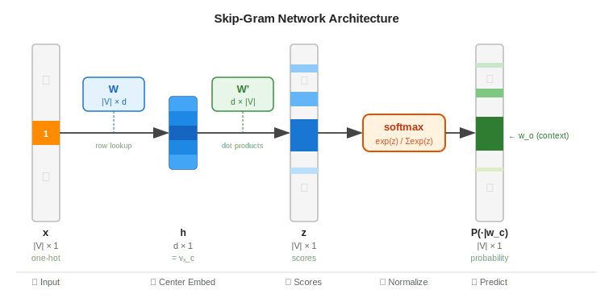
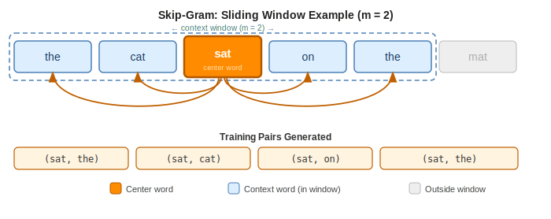

# Skip-Gram Model

> **Core idea:** Train a neural network to predict the surrounding context words given a center word — the weight matrix that results becomes word embeddings.  
> **Why it matters:** Skip-Gram learns dense, real-valued vectors that capture semantic and syntactic relationships between words purely from raw text.  
> **Key trade-off:** Richer context windows and larger corpora yield better embeddings, but training cost grows with vocabulary size — solved in practice by Negative Sampling.

---

## 1. Background and Motivation

### 1.1 The Problem with Sparse Representations

Classical NLP represents words as **one-hot vectors** of size $|V|$ (vocabulary size). These vectors are:

- Extremely high-dimensional ($|V|$ can be $10^5$–$10^6$).
- Orthogonal to each other — dot product between any two words is always 0.
- Blind to meaning: "king" and "queen" are no more similar than "king" and "banana".

What we want is a **dense, low-dimensional** representation where similar words are close together.

### 1.2 The Distributional Hypothesis

Skip-Gram is grounded in the **distributional hypothesis**:

> *"A word is characterized by the company it keeps."* — Firth, 1957

Words that appear in similar contexts tend to have similar meanings. By training a model to predict context, we implicitly encode meaning into the weights.

### 1.3 Word2Vec Family

Skip-Gram is one of the two architectures introduced in **Word2Vec** (Mikolov et al., 2013):

| Architecture | Input → Predict | Typical use |
|---|---|---|
| **Skip-Gram** | Center word → Context words | Rare words, smaller data |
| **CBOW** (Continuous Bag of Words) | Context words → Center word | Frequent words, larger data |

Skip-Gram generally performs better on infrequent words because it generates more training examples per token.

---

## 2. Model Overview

### 2.1 Task Definition

Given a center word $w_c$ at position $t$ in a sentence, predict each of the surrounding **context words** within a window of size $m$:

$$
\{w_{t-m},\; w_{t-m+1},\; \dots,\; w_{t-1},\; w_{t+1},\; \dots,\; w_{t+m}\}
$$

The model is trained to maximize the probability of all context words given the center word across the entire corpus.

### 2.2 Objective Function

For a corpus of $T$ tokens, the training objective is to maximize:

$$
\mathcal{L} = \frac{1}{T} \sum_{t=1}^{T} \sum_{\substack{-m \leq j \leq m \\ j \neq 0}} \log P(w_{t+j} \mid w_t)
$$

Equivalently, minimize the negative log-likelihood:

$$
\boxed{J = -\frac{1}{T} \sum_{t=1}^{T} \sum_{\substack{-m \leq j \leq m \\ j \neq 0}} \log P(w_{t+j} \mid w_t)}
$$

---

## 3. Network Architecture

### 3.1 Two Embedding Matrices

The model maintains **two separate matrices**:

| Matrix | Shape | Role |
|---|---|---|
| $\mathbf{W}$ (input) | $\vert V \vert \times d$ | Center word embeddings |
| $\mathbf{W}'$ (output) | $d \times \vert V \vert$ | Context word embeddings |

Where $d$ is the embedding dimension (typically 100–300).

Each word $w$ has:
- A **center vector** $\mathbf{v}_w$ — row of $\mathbf{W}$
- A **context vector** $\mathbf{u}_w$ — column of $\mathbf{W}'$

### 3.2 Forward Pass

**Step 1 — Lookup.** Get the center word vector via a one-hot input $\mathbf{x} \in \{0,1\}^{|V|}$:

$$
\mathbf{h} = \mathbf{W}^\top \mathbf{x} = \mathbf{v}_{w_c} \in \mathbb{R}^d
$$

This is simply a row lookup — no non-linear activation is applied.

**Step 2 — Score.** Compute a score for each vocabulary word as the dot product with its context vector:

$$
z_o = \mathbf{u}_{w_o}^\top \mathbf{v}_{w_c} \quad \forall\, w_o \in V
$$

High dot product → word $w_o$ is likely to appear near $w_c$.

**Step 3 — Softmax.** Convert scores to a probability distribution over the vocabulary:

$$
P(w_o \mid w_c) = \frac{\exp\!\left(\mathbf{u}_{w_o}^\top \mathbf{v}_{w_c}\right)}{\displaystyle\sum_{w \in V} \exp\!\left(\mathbf{u}_w^\top \mathbf{v}_{w_c}\right)}
$$

---

## 4. Training with Backpropagation

### 4.1 Loss for a Single (Center, Context) Pair

For center word $w_c$ and context word $w_o$, the loss is the negative log-probability:

$$
J(w_c, w_o) = -\log P(w_o \mid w_c) = -\mathbf{u}_{w_o}^\top \mathbf{v}_{w_c} + \log \sum_{w \in V} \exp\!\left(\mathbf{u}_w^\top \mathbf{v}_{w_c}\right)
$$

### 4.2 Gradient with Respect to Center Vector

$$
\frac{\partial J}{\partial \mathbf{v}_{w_c}} = -\mathbf{u}_{w_o} + \sum_{w \in V} P(w \mid w_c)\, \mathbf{u}_w
$$

Interpretation:
- $-\mathbf{u}_{w_o}$: push the center vector **toward** the true context vector.
- $\sum P(w \mid w_c)\, \mathbf{u}_w$: weighted average of all context vectors — the **expected** context, which is pushed **away**.

### 4.3 Gradient with Respect to Context Vectors

For the true context word $w_o$:

$$
\frac{\partial J}{\partial \mathbf{u}_{w_o}} = -\mathbf{v}_{w_c} + P(w_o \mid w_c)\, \mathbf{v}_{w_c} = \left(P(w_o \mid w_c) - 1\right)\mathbf{v}_{w_c}
$$

For any other word $w \neq w_o$:

$$
\frac{\partial J}{\partial \mathbf{u}_w} = P(w \mid w_c)\, \mathbf{v}_{w_c}
$$

### 4.4 The Computational Bottleneck

Computing the softmax denominator requires summing over the entire vocabulary:

$$
Z = \sum_{w \in V} \exp\!\left(\mathbf{u}_w^\top \mathbf{v}_{w_c}\right)
$$

With $|V| = 10^5$ tokens and millions of training steps, this is prohibitively expensive. Two efficient approximations solve this: **Hierarchical Softmax** and **Negative Sampling**.

---

## 5. Negative Sampling

Negative Sampling (NEG) replaces the expensive softmax with a binary classification task: distinguish the true context word from randomly sampled **noise words**.

### 5.1 Reformulation

Instead of predicting one correct word out of all $|V|$, train a **logistic regression** classifier:

- Label $y = 1$: the word $w_o$ is a true context of $w_c$.
- Label $y = 0$: the word $w_n$ is a noise (randomly sampled) word.

The new objective for one center-context pair with $K$ negative samples:

$$
\boxed{J_\text{NEG} = -\log \sigma\!\left(\mathbf{u}_{w_o}^\top \mathbf{v}_{w_c}\right) - \sum_{k=1}^{K} \log \sigma\!\left(-\mathbf{u}_{w_k}^\top \mathbf{v}_{w_c}\right)}
$$

Where $\sigma(x) = \frac{1}{1+e^{-x}}$ is the sigmoid function and $w_1, \dots, w_K$ are noise words drawn from the noise distribution $P_n(w)$.

### 5.2 Noise Distribution

Mikolov et al. found the best results with a **smoothed unigram distribution**:

$$
P_n(w) = \frac{f(w)^{3/4}}{\displaystyle\sum_{w' \in V} f(w')^{3/4}}
$$

Where $f(w)$ is the unigram frequency of word $w$. The exponent $\frac{3}{4}$ flattens the distribution relative to raw frequencies, giving rare words a higher chance of being sampled as negatives.

### 5.3 Why It Works

Each gradient update now touches only $K+1$ context vectors (1 positive + $K$ negatives) instead of all $|V|$. Typical values: $K = 5$–$20$ for small data, $K = 2$–$5$ for large data.

### 5.4 Gradients Under Negative Sampling

For the positive pair:

$$
\frac{\partial J_\text{NEG}}{\partial \mathbf{v}_{w_c}} = \left(\sigma\!\left(\mathbf{u}_{w_o}^\top \mathbf{v}_{w_c}\right) - 1\right)\mathbf{u}_{w_o} + \sum_{k=1}^{K} \sigma\!\left(\mathbf{u}_{w_k}^\top \mathbf{v}_{w_c}\right)\,\mathbf{u}_{w_k}
$$

Interpretation:
- If the model already correctly scores $w_o$ high ($\sigma \approx 1$), the positive gradient is near zero.
- If a noise word $w_k$ is scored too high ($\sigma \approx 1$), its gradient pushes $\mathbf{v}_{w_c}$ away from $\mathbf{u}_{w_k}$.

---

## 6. Subsampling of Frequent Words

Very frequent words (e.g., *"the"*, *"a"*, *"is"*) appear in almost every context window but carry little semantic information. Mikolov et al. introduced **subsampling** to downsample them during training.

Each word $w_i$ in the corpus is discarded with probability:

$$
P_\text{discard}(w_i) = 1 - \sqrt{\frac{t}{f(w_i)}}
$$

Where:
- $f(w_i)$: unigram frequency of word $w_i$
- $t$: threshold hyperparameter (typically $t = 10^{-5}$)

Words with $f(w_i) \gg t$ are discarded with high probability; rare words ($f(w_i) \ll t$) are almost never discarded.

**Effect:** Speeds up training and improves embedding quality for rare words by effectively increasing the window size between remaining words.

---

## 7. Dynamic Context Window

Rather than using a fixed window of exactly $m$ on each side, Skip-Gram uses a **dynamic window**: for each center word, the actual window size $m'$ is sampled uniformly from $\{1, 2, \dots, m\}$.

This means words closer to the center word are sampled as contexts more often (since they are included in all window sizes), implicitly weighting them higher.

---

## 8. Worked Example

A full numerical walkthrough with a toy vocabulary and 2-dimensional embeddings, tracing every computation from the center word lookup through to the gradient update.

### 8.1 Setup

**Vocabulary** ($|V| = 5$, indexed 0–4):

| Index | Word |
|---|---|
| 0 | the |
| 1 | cat |
| 2 | sat |
| 3 | on |
| 4 | mat |

**Sentence:** `the cat sat on mat`  
**Center word:** $w_c =$ **"sat"** (index 2), at position $t = 2$  
**Window size:** $m = 1$ → context = {**"cat"** (1), **"on"** (3)}  
**Training pairs:** `(sat, cat)` and `(sat, on)` — processed one pair at a time.

**Embedding dimension:** $d = 2$

**Input (center-word) embedding matrix $\mathbf{W} \in \mathbb{R}^{5 \times 2}$:**

$$
\mathbf{W} = \begin{pmatrix}
0.1 & 0.2 \\
0.3 & 0.5 \\
0.6 & 0.1 \\
0.4 & 0.8 \\
0.2 & 0.3
\end{pmatrix}
\quad
\begin{array}{l} \text{the} \\ \text{cat} \\ \text{sat} \\ \text{on} \\ \text{mat} \end{array}
$$

**Output (context-word) embedding matrix $\mathbf{W}' \in \mathbb{R}^{2 \times 5}$** (each column $\mathbf{u}_w$):

$$
\mathbf{W}' = \begin{pmatrix}
0.1 & 0.2 & 0.5 & 0.3 & 0.1 \\
0.4 & 0.1 & 0.6 & 0.2 & 0.3
\end{pmatrix}
$$

---

### 8.2 Step 1 — Center Word Lookup

Look up "sat" (index 2) in $\mathbf{W}$:

$$
\mathbf{v}_{\text{sat}} = \mathbf{W}[2] = \begin{pmatrix} 0.6 \\ 0.1 \end{pmatrix}
$$

This single vector is shared across **every** context prediction in this window — the same $\mathbf{v}_\text{sat}$ is used to predict both "cat" and "on".

---

### 8.3 Step 2 — Output Scores

Compute $z_w = \mathbf{u}_w^\top \mathbf{v}_{\text{sat}}$ for every word in the vocabulary:

| Word | $\mathbf{u}_w^\top$ | $z_w = \mathbf{u}_w^\top \mathbf{v}_\text{sat}$ |
|---|---|---|
| the  | $(0.1,\ 0.4)$ | $0.1 \times 0.6 + 0.4 \times 0.1 = 0.06 + 0.04 = \mathbf{0.100}$ |
| cat  | $(0.2,\ 0.1)$ | $0.2 \times 0.6 + 0.1 \times 0.1 = 0.12 + 0.01 = \mathbf{0.130}$ |
| sat  | $(0.5,\ 0.6)$ | $0.5 \times 0.6 + 0.6 \times 0.1 = 0.30 + 0.06 = \mathbf{0.360}$ |
| on   | $(0.3,\ 0.2)$ | $0.3 \times 0.6 + 0.2 \times 0.1 = 0.18 + 0.02 = \mathbf{0.200}$ |
| mat  | $(0.1,\ 0.3)$ | $0.1 \times 0.6 + 0.3 \times 0.1 = 0.06 + 0.03 = \mathbf{0.090}$ |

---

### 8.4 Step 3 — Softmax

Exponentiate all scores:

$$
e^{0.100} \approx 1.105, \quad
e^{0.130} \approx 1.139, \quad
e^{0.360} \approx 1.433, \quad
e^{0.200} \approx 1.221, \quad
e^{0.090} \approx 1.094
$$

$$
Z = 1.105 + 1.139 + 1.433 + 1.221 + 1.094 = 5.992
$$

$$
P(\cdot \mid \text{sat}) \approx (0.184,\ \mathbf{0.190},\ 0.239,\ \mathbf{0.204},\ 0.183)
$$

The two true context words receive:

$$
P(\text{cat} \mid \text{sat}) \approx 0.190, \qquad P(\text{on} \mid \text{sat}) \approx 0.204
$$

---

### 8.5 Step 4 — Loss

Skip-Gram computes a **separate loss for each training pair**. The total loss over this window is the sum:

$$
J = -\log P(\text{cat} \mid \text{sat}) - \log P(\text{on} \mid \text{sat})
$$

$$
J = -\log(0.190) - \log(0.204) \approx 1.661 + 1.590 = \mathbf{3.251}
$$

Each pair contributes independently to the total loss. The gradient of $\mathbf{v}_\text{sat}$ accumulates contributions from both pairs before a single weight update is applied.

---

### 8.6 Step 5 — Error Signal and Gradient Updates

The error vector for the pair `(sat, cat)` is $(\hat{\mathbf{y}} - \mathbf{y})$:

| Word | $\hat{y}_w$ | $y_w$ | $\hat{y}_w - y_w$ |
|---|---|---|---|
| the  | 0.184 | 0 | +0.184 |
| **cat**  | **0.190** | **1** | **−0.810** |
| sat  | 0.239 | 0 | +0.239 |
| on   | 0.204 | 0 | +0.204 |
| mat  | 0.183 | 0 | +0.183 |

Gradient update for the center vector $\mathbf{v}_\text{sat}$ (pair `sat → cat`):

$$
\frac{\partial J}{\partial \mathbf{v}_\text{sat}} = \sum_{w \in V} (\hat{y}_w - y_w)\,\mathbf{u}_w = \mathbf{W}'^{\,\top}(\hat{\mathbf{y}} - \mathbf{y})
$$

$$
= (+0.184)\begin{pmatrix}0.1\\0.4\end{pmatrix}
+ (-0.810)\begin{pmatrix}0.2\\0.1\end{pmatrix}
+ (+0.239)\begin{pmatrix}0.5\\0.6\end{pmatrix}
+ (+0.204)\begin{pmatrix}0.3\\0.2\end{pmatrix}
+ (+0.183)\begin{pmatrix}0.1\\0.3\end{pmatrix}
$$

$$
= \begin{pmatrix}
0.184(0.1) - 0.810(0.2) + 0.239(0.5) + 0.204(0.3) + 0.183(0.1) \\
0.184(0.4) - 0.810(0.1) + 0.239(0.6) + 0.204(0.2) + 0.183(0.3)
\end{pmatrix}
= \begin{pmatrix} 0.057 \\ 0.212 \end{pmatrix}
$$

The same process is repeated for pair `(sat, on)`, and the two gradients are **accumulated** into $\mathbf{v}_\text{sat}$ before the weight update. Each context word's output vector $\mathbf{u}_w$ is updated independently using only its own error term $(\hat{y}_w - y_w)\,\mathbf{v}_\text{sat}$.

---

### 8.7 Sliding Window Context

For the full sentence `the cat sat on mat` with $m = 2$, Skip-Gram slides the window across every position:

| Center | Context | Training pair |
|--------|---------|---------------|
| `the`  | `cat`   | (the, cat) |
| `the`  | `sat`   | (the, sat) |
| `cat`  | `the`   | (cat, the) |
| `cat`  | `sat`   | (cat, sat) |
| `cat`  | `on`    | (cat, on) |
| `sat`  | `the`   | (sat, the) |
| `sat`  | `cat`   | (sat, cat) |
| `sat`  | `on`    | (sat, on) |
| `sat`  | `mat`   | (sat, mat) |
| ... | ... | ... |

Every pair is treated as an independent example — the model learns that "sat" tends to appear near "cat", "on", "the", and "mat" by receiving a gradient signal for each co-occurrence separately.

---

## 9. Embedding Properties

### 9.1 Linear Analogies

After training, the embeddings exhibit remarkable **linear algebraic structure**:

$$
\mathbf{v}_\text{king} - \mathbf{v}_\text{man} + \mathbf{v}_\text{woman} \approx \mathbf{v}_\text{queen}
$$

This works because the model encodes relational meaning in the directions of the embedding space.

### 9.2 Word Similarity

Semantic similarity between words is measured by **cosine similarity**:

$$
\text{sim}(w_1, w_2) = \frac{\mathbf{v}_{w_1} \cdot \mathbf{v}_{w_2}}{\|\mathbf{v}_{w_1}\|\, \|\mathbf{v}_{w_2}\|}
$$

Words like *"doctor"* and *"nurse"* end up with high cosine similarity; *"doctor"* and *"banana"* do not.

### 9.3 Which Vectors to Use

After training, both $\mathbf{W}$ and $\mathbf{W}'$ contain word vectors. In practice:
- Use $\mathbf{v}_w$ from $\mathbf{W}$ (input matrix) as the final embeddings.
- Alternatively, sum or average $\mathbf{v}_w + \mathbf{u}_w$ — sometimes improves results slightly.
- Discard $\mathbf{W}'$ in most downstream applications.

---

## 10. Hyperparameters and Practical Tips

| Hyperparameter | Typical range | Effect |
|---|---|---|
| Embedding dimension $d$ | 100–300 | Higher = richer but slower; diminishing returns beyond 300 |
| Window size $m$ | 5–10 | Larger captures more topical similarity |
| Negative samples $K$ | 5–20 (small), 2–5 (large) | More negatives = better estimate but slower |
| Subsampling threshold $t$ | $10^{-5}$ | Lower = more aggressive downsampling |
| Learning rate | 0.025 (linear decay to 0) | Decays over training |
| Min word count | 5 | Discard rare words before training |

**Training tips:**
1. Shuffle the corpus before each epoch.
2. Decay the learning rate linearly from $\alpha_0$ to $0$ over training.
3. Discard words below a minimum count threshold — they don't have enough context to form good embeddings.
4. For very large vocabularies, consider using `fastText` (subword-aware Skip-Gram) to handle OOV words.

---

## 11. Skip-Gram vs. CBOW

| Property | Skip-Gram | CBOW |
|---|---|---|
| Prediction task | Center → each context word | Average context → center word |
| Training examples per token | $2m$ pairs | 1 example |
| Performance on rare words | Better | Worse |
| Training speed | Slower | Faster |
| Performance on frequent words | Comparable | Comparable or better |

The key reason Skip-Gram handles rare words better: it produces $2m$ training signal updates per token, so even words seen 10–20 times accumulate enough gradient updates to form meaningful embeddings.

---

## 12. Limitations and Extensions

| Limitation | Extension |
|---|---|
| Static embeddings (one vector per word) | ELMo, BERT — contextual embeddings |
| Cannot handle OOV words | fastText — character n-gram subword embeddings |
| No morphological awareness | BPE tokenization + subword models |
| Window-based co-occurrence only | GloVe — global co-occurrence matrix factorization |
| No explicit syntax | Dependency-based embeddings |

Despite these limitations, pre-trained Word2Vec Skip-Gram embeddings remain a strong, fast baseline and are still used in lightweight production systems where large language models are too expensive to deploy.
