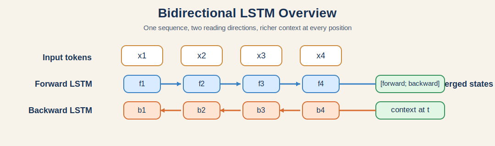
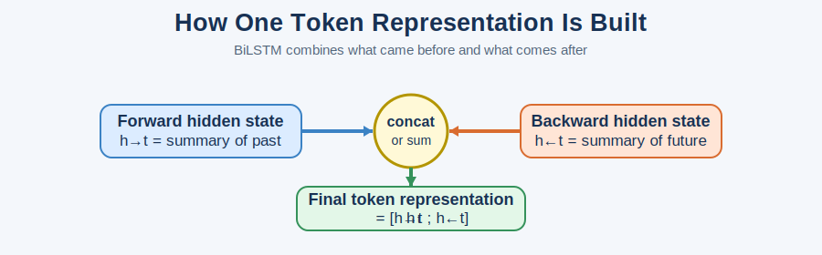
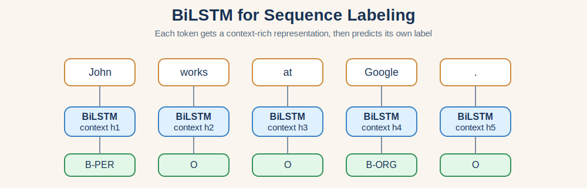

# Bidirectional LSTM (BiLSTM)

Bidirectional LSTM, usually written as **BiLSTM**, is an extension of LSTM that reads the same sequence in **two directions**:

* one LSTM reads from left to right
* another LSTM reads from right to left

This means each time step can use both **past context** and **future context**.

For learning sequence models, this is one of the most important upgrades over a one-direction LSTM.



---

## 1. Why do we need BiLSTM?

A normal LSTM only sees the sequence in one direction.

If we process the sentence:

> "The bank approved the loan."

when the model reaches the word **bank**, the meaning can be clearer if it also knows later words such as **approved** and **loan**.

The same idea appears in many tasks:

* **Part-of-speech tagging**: the tag of a word often depends on the words before and after it.
* **Named entity recognition**: whether a token is a person, place, or organization often needs both-side context.
* **Speech recognition**: the current sound can be interpreted better with surrounding sounds.
* **Text classification**: the full sentence meaning may depend on words near the end.

So the main motivation of BiLSTM is simple:

> some sequence decisions are easier when the model can see the left context and the right context together.

---

## 2. Intuition

Imagine you are reading a sentence to understand a difficult word.

There are two ways to do it:

1. Read from the beginning to the current word.
2. Read from the end back to the current word.

If you combine both readings, your understanding is usually better.

That is exactly what BiLSTM does.

* The **forward LSTM** summarizes what has appeared before position $t$.
* The **backward LSTM** summarizes what appears after position $t$.
* Their hidden states are then combined into one richer representation.



---

## 3. From LSTM to BiLSTM

### 3.1 Standard LSTM review

At time step $t$, a standard LSTM takes input $x_t$ and updates:

* hidden state $h_t$
* cell state $c_t$

The usual equations are:

$$
f_t = \sigma(W_f [h_{t-1}, x_t] + b_f)
$$

$$
i_t = \sigma(W_i [h_{t-1}, x_t] + b_i)
$$

$$
g_t = \tanh(W_c [h_{t-1}, x_t] + b_c)
$$

$$
c_t = f_t \odot c_{t-1} + i_t \odot g_t
$$

$$
o_t = \sigma(W_o [h_{t-1}, x_t] + b_o)
$$

$$
h_t = o_t \odot \tanh(c_t)
$$

The limitation is that $h_t$ mainly carries information from the **past**.

### 3.2 BiLSTM idea

BiLSTM uses **two independent LSTMs**:

* forward LSTM: processes $x_1 \rightarrow x_2 \rightarrow ... \rightarrow x_T$
* backward LSTM: processes $x_T \rightarrow x_{T-1} \rightarrow ... \rightarrow x_1$

So at each time step $t$ we get two hidden states:

$$
\overrightarrow{h_t} = \text{LSTM}_{\text{forward}}(x_t, \overrightarrow{h_{t-1}}, \overrightarrow{c_{t-1}})
$$

$$
\overleftarrow{h_t} = \text{LSTM}_{\text{backward}}(x_t, \overleftarrow{h_{t+1}}, \overleftarrow{c_{t+1}})
$$

Then we combine them, usually by concatenation:

$$
h_t = [\overrightarrow{h_t}; \overleftarrow{h_t}]
$$

This combined vector $h_t$ contains information from both directions.

---

## 4. How the sequence flows

Suppose the input sequence is:

$$
x_1, x_2, x_3, x_4
$$

The forward LSTM computes:

$$
\overrightarrow{h_1}, \overrightarrow{h_2}, \overrightarrow{h_3}, \overrightarrow{h_4}
$$

The backward LSTM computes:

$$
\overleftarrow{h_1}, \overleftarrow{h_2}, \overleftarrow{h_3}, \overleftarrow{h_4}
$$

For each position:

$$
h_1 = [\overrightarrow{h_1}; \overleftarrow{h_1}], \quad
h_2 = [\overrightarrow{h_2}; \overleftarrow{h_2}], \quad
h_3 = [\overrightarrow{h_3}; \overleftarrow{h_3}], \quad
h_4 = [\overrightarrow{h_4}; \overleftarrow{h_4}]
$$

So the representation at each token is richer than in a one-way LSTM.

---

## 5. What exactly gets combined?

There are several common choices.

### 5.1 Concatenation

Most common:

$$
h_t = [\overrightarrow{h_t}; \overleftarrow{h_t}]
$$

If each direction has hidden size $H$, then the output size becomes $2H$.

### 5.2 Sum

Sometimes people add the two vectors:

$$
h_t = \overrightarrow{h_t} + \overleftarrow{h_t}
$$

This keeps the size at $H$, but may lose some directional information.

### 5.3 Average

$$
h_t = \frac{\overrightarrow{h_t} + \overleftarrow{h_t}}{2}
$$

This is also used sometimes, but concatenation is still the default choice in most learning material and implementations.

---

## 6. Output shapes

This is a point that often confuses beginners.

Assume:

* batch size = $B$
* sequence length = $T$
* input size = $D$
* hidden size per direction = $H$

Then for a PyTorch BiLSTM with `batch_first=True`:

* input shape: `(B, T, D)`
* output shape: `(B, T, 2H)`

Why `2H`?

Because the forward hidden vector has size $H$ and the backward hidden vector also has size $H$, and they are concatenated.

For the final hidden state:

* hidden shape: `(num_layers * 2, B, H)`
* cell shape: `(num_layers * 2, B, H)`

The factor `2` comes from the two directions.

---

## 7. BiLSTM for different tasks

### 7.1 Sequence labeling

This is where BiLSTM is especially strong.

Example tasks:

* named entity recognition
* part-of-speech tagging
* chunking

For each token $t$, the model uses the combined state $h_t$ to predict a label:

$$
y_t = W h_t + b
$$

This works well because predicting the label of token $t$ often needs both left and right context.

### 7.2 Sequence classification

For sentence classification or document classification, we often need a single vector for the whole sequence.

Common choices:

* use the last forward state and the last backward state
* apply max pooling over all time steps
* apply mean pooling over all time steps

One simple approach is:

$$
h_{\text{seq}} = [\overrightarrow{h_T}; \overleftarrow{h_1}]
$$

Then feed it into a classifier.

### 7.3 Encoder in encoder-decoder models

BiLSTM is often used as an encoder because the encoder benefits from understanding the full input sequence. This was especially common before Transformers became dominant.



---

## 8. Example: why BiLSTM helps more than LSTM

Consider the sentence:

> "He drove the car to the bank."

The word **bank** may mean a financial institution or the side of a river.

If the model only reads left to right, it sees:

* He
* drove
* the
* car
* to
* the
* bank

This is useful, but still incomplete.

Now consider another sentence:

> "He sat on the bank of the river."

The phrase **of the river** appears **after** the word bank. A forward-only LSTM cannot use that future context at the exact moment it creates the representation for **bank**.

A BiLSTM can, because the backward LSTM has already read the words from the right side.

This is the main advantage.

---

## 9. Advantages of BiLSTM

* It captures both past and future context.
* It usually performs better than one-way LSTM on token-level prediction tasks.
* It is still easier to understand than many newer architectures.
* It handles sequential order naturally.
* It is a strong baseline for many NLP and speech tasks.

---

## 10. Limitations of BiLSTM

BiLSTM is useful, but it is not always the best choice.

### 10.1 It cannot be truly online in both directions

Because the backward LSTM needs future tokens, full BiLSTM is not suitable for real-time settings where future input is unavailable.

Example:

* live speech streaming
* real-time next-word prediction

### 10.2 Training is harder to parallelize than Transformers

Even though there are two directions, each LSTM direction is still recurrent. That means computation depends on previous time steps, so it is less parallel-friendly than self-attention models.

### 10.3 Longer training time than one-way LSTM

There are effectively two recurrent passes, so the model is heavier than a single-direction LSTM.

### 10.4 Memory usage increases

Since output size often becomes $2H$, later layers may also become larger.

---

## 11. BiLSTM vs LSTM

| Model | Reads left context | Reads right context | Output size per step | Best use case |
| --- | --- | --- | --- | --- |
| LSTM | Yes | No | $H$ | causal or streaming sequence tasks |
| BiLSTM | Yes | Yes | usually $2H$ | offline sequence understanding |

Short version:

* choose **LSTM** when the future is unavailable
* choose **BiLSTM** when the full sequence is available and context from both sides matters

---

## 12. BiLSTM vs GRU vs Transformer

### BiLSTM vs GRU

* GRU is usually simpler and lighter.
* BiLSTM often gives a richer representation when both-side context is important.
* A bidirectional GRU also exists, called BiGRU.

### BiLSTM vs Transformer

* Transformer captures global context more directly through attention.
* BiLSTM is often simpler for small datasets and easier to explain from a sequence-modeling viewpoint.
* Transformer is generally more scalable and dominant in modern NLP.

So BiLSTM remains important for learning and for smaller practical systems, even if it is no longer the default choice for large-scale NLP.

---

## 13. PyTorch implementation example

Below is a minimal BiLSTM classifier for sequence classification.

```python
import torch
import torch.nn as nn


class BiLSTMClassifier(nn.Module):
	def __init__(self, input_size, hidden_size, num_layers, num_classes):
		super().__init__()
		self.hidden_size = hidden_size
		self.num_layers = num_layers

		self.bilstm = nn.LSTM(
			input_size=input_size,
			hidden_size=hidden_size,
			num_layers=num_layers,
			batch_first=True,
			bidirectional=True,
		)

		self.fc = nn.Linear(hidden_size * 2, num_classes)

	def forward(self, x):
		output, (hidden, cell) = self.bilstm(x)

		forward_last = hidden[-2]
		backward_last = hidden[-1]
		features = torch.cat((forward_last, backward_last), dim=1)
		logits = self.fc(features)
		return logits


if __name__ == "__main__":
	torch.manual_seed(42)

	x = torch.tensor(
		[
			[[0.0, 0.1], [0.1, 0.0], [0.2, 0.1], [0.1, 0.2]],
			[[1.0, 1.1], [1.2, 1.0], [1.1, 1.2], [1.3, 1.1]],
			[[0.0, 0.2], [0.1, 0.1], [0.1, 0.0], [0.2, 0.1]],
			[[1.1, 1.0], [1.0, 1.2], [1.2, 1.1], [1.1, 1.3]],
		],
		dtype=torch.float32,
	)

	y = torch.tensor([0, 1, 0, 1], dtype=torch.long)

	model = BiLSTMClassifier(
		input_size=2,
		hidden_size=8,
		num_layers=1,
		num_classes=2,
	)

	criterion = nn.CrossEntropyLoss()
	optimizer = torch.optim.Adam(model.parameters(), lr=0.01)

	for epoch in range(1, 201):
		logits = model(x)
		loss = criterion(logits, y)

		optimizer.zero_grad()
		loss.backward()
		optimizer.step()

		if epoch % 50 == 0:
			print(f"Epoch {epoch:3d} | Loss: {loss.item():.4f}")

	with torch.no_grad():
		pred = torch.argmax(model(x), dim=1)

	print("Prediction:", pred.tolist())
	print("Target    :", y.tolist())
```

### Key points in the code

* `bidirectional=True` turns `nn.LSTM` into a BiLSTM.
* The final classifier input size is `hidden_size * 2`.
* `hidden[-2]` is the last hidden state from the forward direction.
* `hidden[-1]` is the last hidden state from the backward direction.

---

## 14. Common beginner mistakes

### Mistake 1: forgetting the output dimension doubles

If the hidden size is $H$, the BiLSTM output is often $2H$, not $H$.

### Mistake 2: using BiLSTM for streaming prediction

If the task must work token by token in real time, a standard BiLSTM is often not appropriate.

### Mistake 3: confusing hidden state with output tensor

* `output` contains the representation at **every time step**
* `hidden` contains the final hidden states for each layer and direction

### Mistake 4: assuming BiLSTM always beats Transformer

BiLSTM is powerful, but on many large NLP tasks Transformer models are stronger.

---

## 15. When should you use BiLSTM?

BiLSTM is a strong choice when:

* the whole sequence is available before prediction
* both left and right context matter
* you want a model that is more interpretable than a Transformer
* your dataset or project size is moderate

BiLSTM is a weaker choice when:

* you need strict left-to-right generation
* you need real-time streaming decisions
* you need maximum parallel training efficiency on very large data

---

## 16. Summary

BiLSTM is built from two LSTMs running in opposite directions.

Its core idea is:

$$
h_t = [\overrightarrow{h_t}; \overleftarrow{h_t}]
$$

That makes it very effective for many sequence understanding tasks, especially token-level tasks such as tagging and entity recognition.

If you remember only three points, remember these:

1. A BiLSTM reads the same sequence in both directions.
2. Each token representation combines forward and backward hidden states.
3. It is especially useful when the meaning of a token depends on both previous and later tokens.

---

## 17. Suggested practice questions

1. Why can BiLSTM usually outperform LSTM on named entity recognition?
2. Why is BiLSTM not ideal for real-time next-word prediction?
3. If hidden size per direction is 64, what is the usual output size at each time step?
4. In PyTorch, why does a bidirectional LSTM often require the next linear layer to use `hidden_size * 2`?
5. What information does the backward LSTM provide that the forward LSTM cannot?

---

## 18. Short answers

1. Because label prediction often depends on both left and right context.
2. Because the backward direction needs future tokens.
3. Usually $128$.
4. Because forward and backward features are concatenated.
5. Future context from the right side of the current token.
