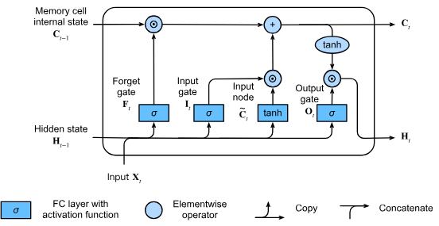

# LSTM (Long Short-Term Memory)

LSTM (Long Short-Term Memory) was designed to address the "forgetting" problem in ordinary RNNs when processing long sequences. You can think of it as a notebook with a fine-grained management mechanism, using three "gates" to decide which information to keep and which to discard.



------------------------------s

## I. Mathematical Explanation

The core of LSTM is the cell state ($C_t$), which acts like a conveyor belt throughout the chain. At each time step $t$, LSTM updates the state through the following four steps:

## 1. Forget Gate – "Cleansing the Old Accounts" This determines which information in the cell state $C_{t-1}$ from the previous time step needs to be discarded.

$$f_t = \sigma(W_f \cdot [h_{t-1}, x_t] + b_f)$$

* $\sigma$ is the Sigmoid function, with an output between 0 and 1 (0 represents discarding everything, 1 represents keeping everything).

## 2. Input Gate – “Recording New Knowledge” Determines which new information to store in the cell state. It consists of two steps:

* Selection weight $i_t$: Determines which positions to update.

* Candidate value $\tilde{C}_t$: The new content to be stored.

$$i_t = \sigma (W_i \cdot [h_{t-1}, x_t] + b_i) \\
\tilde{C}_t = \tanh(W_C \cdot [h_{t-1}, x_t] + b_C)$$

## 3. Updating Cell State – “Ledger Update” Combining the forget gate and the input gate, it transforms the old state into the new state.

$$C_t = f_t * C_{t-1} + i_t * \tilde{C}_t$$

## 4. Output Gate — “Reporting Work” Determines what to output at the current moment (hidden state $h_t$).

$$o_t = \sigma(W_o \cdot [h_{t-1}, x_t] + b_o)$$ $$h_t = o_t * \tanh(C_t)$$

------------------------------

## II. Illustrated Examples To better understand, we can compare LSTM to different scenarios:

## 1. Reading a Long Novel (Contextual Relationship)
Suppose you are reading a detective novel:

* Forget Gate: When you read to chapter five, you discover that suspect A has already died. LSTM will use the forget gate to clear the possibility that "A is the murderer," making room for further possibilities.

* Input Gate: A mysterious butler, B, appears in the book, holding a bloodstained knife. The input gate deems this information important and quickly stores it in your "mental ledger" ($C_t$).

* Cell State: A summary of all current clues about the murderer in your mind.

* Output Gate: When a friend asks you, "Who is most suspicious now?", you answer specifically based on the current ledger information: "Butler B."

## 2. Translate a Sentence (Gender and Tense) Suppose the translation is: "The cats, which I saw yesterday, are hungry."

* Input Gate: Upon seeing the subject "cats" (plural), immediately mark it as "plural" in the state.

* Forget Gate: If a parenthetical phrase ("which I saw yesterday") appears later, the LSTM uses a forget gate to protect the "plural" marker, preventing it from being overwritten by intervening words.

* Output Gate: When it's time to write the predicate verb, the output gate retrieves the memory of "plural," prompting you to write "are" instead of "is."

## 3. Intelligent Customer Service (Emotion Management)

* Input Gate: A customer initially has a very good attitude, but suddenly says, "I am very disappointed with your service."

* Forget Gate: The system immediately forgets the previous "polite" state.

* Cell State: The current state is updated to "angry/complaining."

* Output Gate: The next automatic reply will choose soothing words like "I am deeply sorry."

## Summary 
A regular RNN is like a fish with only short-term memory, forgetting what came before as soon as it sees something new; while an LSTM is like a student who carries a notebook and eraser, always knowing what to write down and what to erase.

## simple LSTM model using PyTorch

```python
import torch
import torch.nn as nn


class LSTMClassifier(nn.Module):
	def __init__(self, input_size, hidden_size, num_layers, num_classes):
		super().__init__()
		self.hidden_size = hidden_size
		self.num_layers = num_layers

		# nn.LSTM reads one sequence step by step and keeps a hidden state.
		# batch_first=True means input shape is (batch_size, seq_len, input_size).
		self.lstm = nn.LSTM(
			input_size=input_size,
			hidden_size=hidden_size,
			num_layers=num_layers,
			batch_first=True,
		)

		# The last time step output is mapped to class scores.
		self.fc = nn.Linear(hidden_size, num_classes)

	def forward(self, x):
		batch_size = x.size(0)

		# h0: initial hidden state, c0: initial cell state.
		# Shape = (num_layers, batch_size, hidden_size)
		h0 = torch.zeros(self.num_layers, batch_size, self.hidden_size, device=x.device)
		c0 = torch.zeros(self.num_layers, batch_size, self.hidden_size, device=x.device)

		# lstm_out shape: (batch_size, seq_len, hidden_size)
		# hn shape: (num_layers, batch_size, hidden_size)
		lstm_out, (hn, cn) = self.lstm(x, (h0, c0))

		# Use the output from the last time step as the sequence summary.
		last_output = lstm_out[:, -1, :]

		# Convert the sequence summary into class logits.
		logits = self.fc(last_output)
		return logits


if __name__ == "__main__":
	torch.manual_seed(42)

	# Each sample is a sequence with 4 time steps.
	# Each time step has 2 features.
	x_train = torch.tensor(
		[
			[[0.0, 0.0], [0.1, 0.2], [0.0, 0.1], [0.2, 0.1]],
			[[1.0, 1.1], [1.2, 0.9], [1.1, 1.0], [1.3, 1.2]],
			[[0.1, 0.0], [0.2, 0.1], [0.1, 0.2], [0.0, 0.1]],
			[[1.1, 1.0], [1.0, 1.2], [1.2, 1.1], [1.3, 1.0]],
		],
		dtype=torch.float32,
	)

	# Class 0 = small values, Class 1 = large values.
	y_train = torch.tensor([0, 1, 0, 1], dtype=torch.long)

	model = LSTMClassifier(
		input_size=2,
		hidden_size=8,
		num_layers=1,
		num_classes=2,
	)

	criterion = nn.CrossEntropyLoss()
	optimizer = torch.optim.Adam(model.parameters(), lr=0.01)

	print("Input shape:", x_train.shape)
	print("Label shape:", y_train.shape)

	for epoch in range(1, 201):
		model.train()

		# Forward pass: model predicts class logits for each sequence.
		logits = model(x_train)
		loss = criterion(logits, y_train)

		# Backward pass: compute gradients and update weights.
		optimizer.zero_grad()
		loss.backward()
		optimizer.step()

		if epoch % 50 == 0:
			print(f"Epoch {epoch:3d} | Loss: {loss.item():.4f}")

	model.eval()
	with torch.no_grad():
		logits = model(x_train)
		predictions = torch.argmax(logits, dim=1)

	print("Predicted classes:", predictions.tolist())
	print("True classes     :", y_train.tolist())
```
