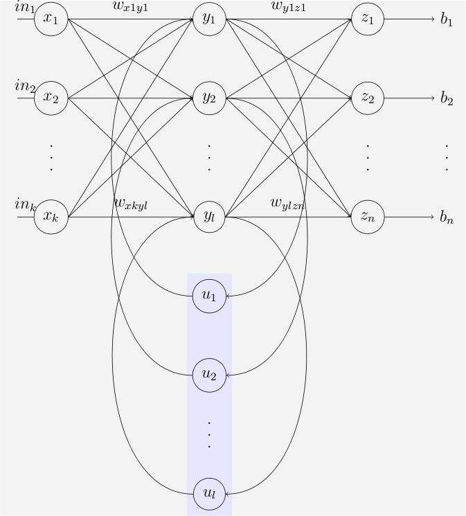

# RNN: Recurrent Neural Network

> **Core idea:** Use a recurrent hidden state to model sequence dependencies over time.  
> **Classic variant:** Elman RNN (simple/vanilla RNN)  
> **Follow-up variants:** LSTM (1997), GRU (2014)

---

## 1. Introduction / Overview

A **Recurrent Neural Network (RNN)** is a neural architecture designed for **ordered data** such as text, speech, sensor streams, and time series.

Unlike feedforward networks (which treat each input independently), an RNN carries a hidden state $h_t$ from one time step to the next:

$$
h_t = f(x_t, h_{t-1})
$$

This gives the model a form of memory, so the prediction at time $t$ can depend on previous inputs.

Typical applications:

- Next-token prediction in language modeling
- Sequence classification (sentiment, intent)
- Sequence labeling (POS tagging, NER)
- Time-series forecasting and anomaly detection

---

## 2. Architecture

### 2.1 Vanilla RNN Cell

At each time step:

$$
h_t = \phi(W_{xh}x_t + W_{hh}h_{t-1} + b_h)
$$

$$
y_t = W_{hy}h_t + b_y
$$

Where:

- $x_t \in \mathbb{R}^{d}$: input at step $t$
- $h_t \in \mathbb{R}^{h}$: hidden state
- $y_t \in \mathbb{R}^{o}$: output (logits or regression value)
- $\phi$: nonlinearity, usually $\tanh$ or ReLU

### 2.2 Unrolling Through Time

An RNN can be viewed as the **same cell reused** at every time step with shared weights.

- Same parameters: $W_{xh}, W_{hh}, W_{hy}$ for all $t$
- Different inputs: $x_1, x_2, \dots, x_T$
- Hidden state links steps over time: $h_0 \to h_1 \to ... \to h_T$

### 2.3 Training with BPTT

Given sequence loss:

$$
\mathcal{L} = \sum_{t=1}^{T} \ell(y_t, \hat{y}_t)
$$

Gradients are propagated from later steps back to earlier steps through recurrent transitions.

Approximate sensitivity across $k$ steps:

$$
\frac{\partial h_t}{\partial h_{t-k}} \approx \prod_{i=t-k+1}^{t} W_{hh}^\top \operatorname{diag}(\phi'(a_i))
$$

If the effective spectral norm of factors is $< 1$, gradients vanish; if $> 1$, they explode.

---

## 3. Images for Illustration (Downloaded from Internet)

### 3.1 Standard RNN: Compressed vs Unfolded


Source: fdeloche, Wikimedia Commons, CC BY-SA 4.0  
Original: https://commons.wikimedia.org/wiki/File:Recurrent_neural_network_unfold.svg

### 3.2 Elman Simple Recurrent Neural Network



Source: Fyedernoggersnodden, Wikimedia Commons, CC BY 3.0  
Original: https://commons.wikimedia.org/wiki/File:Elman_srnn.png

---

## 4. Math Formula Summary

### 4.1 Forward pass (sequence)

$$
h_0 = 0
$$

$$
h_t = \tanh(W_{xh}x_t + W_{hh}h_{t-1} + b_h), \quad t=1,...,T
$$

$$
o_t = W_{hy}h_t + b_y, \quad
\hat{y}_t = \operatorname{softmax}(o_t)
$$

### 4.2 Sequence objective (classification example)

If only final output is used:

$$
\mathcal{L} = -\sum_{c=1}^{C} y_c \log \hat{y}_{T,c}
$$

If every time step is supervised:

$$
\mathcal{L} = \sum_{t=1}^{T} -\sum_{c=1}^{C} y_{t,c}\log\hat{y}_{t,c}
$$

### 4.3 Why gradients can vanish

Ignoring bias terms and nonlinear details, recurrent influence scales roughly as:

$$
\left\|\frac{\partial h_t}{\partial h_{t-k}}\right\| \propto \|W_{hh}\|^k
$$

- If $\|W_{hh}\| < 1$, long-term gradients decay exponentially
- If $\|W_{hh}\| > 1$, long-term gradients explode

This is the core reason gated models like GRU/LSTM became dominant.

---

## 5. Sample Code

### 5.1 Minimal Vanilla RNN Cell (NumPy)

```python
import numpy as np


def softmax(x: np.ndarray) -> np.ndarray:
	x = x - np.max(x)
	e = np.exp(x)
	return e / np.sum(e)


class VanillaRNNCell:
	"""Single-step vanilla RNN cell for educational forward-pass demos."""

	def __init__(self, input_size: int, hidden_size: int, output_size: int):
		self.W_xh = np.random.randn(hidden_size, input_size) * 0.1
		self.W_hh = np.random.randn(hidden_size, hidden_size) * 0.1
		self.b_h = np.zeros((hidden_size, 1))

		self.W_hy = np.random.randn(output_size, hidden_size) * 0.1
		self.b_y = np.zeros((output_size, 1))

	def step(self, x_t: np.ndarray, h_prev: np.ndarray):
		# x_t: (input_size, 1), h_prev: (hidden_size, 1)
		h_t = np.tanh(self.W_xh @ x_t + self.W_hh @ h_prev + self.b_h)
		o_t = self.W_hy @ h_t + self.b_y
		y_t = softmax(o_t)
		return h_t, y_t


if __name__ == "__main__":
	np.random.seed(42)
	rnn = VanillaRNNCell(input_size=4, hidden_size=8, output_size=3)

	h = np.zeros((8, 1))
	sequence = [np.random.randn(4, 1) for _ in range(5)]

	for t, x in enumerate(sequence, start=1):
		h, y = rnn.step(x, h)
		print(f"t={t}, predicted probs={y.ravel()}")
```

### 2.2 Sequence Classifier with PyTorch `nn.RNN`

```python
import torch
import torch.nn as nn


class RNNClassifier(nn.Module):
	def __init__(self, input_size: int, hidden_size: int, num_layers: int, num_classes: int):
		super().__init__()
		self.rnn = nn.RNN(
			input_size=input_size,
			hidden_size=hidden_size,
			num_layers=num_layers,
			batch_first=True,
			nonlinearity="tanh",
		)
		self.fc = nn.Linear(hidden_size, num_classes)

	def forward(self, x):
		# x: (batch, seq_len, input_size)
		out, h_n = self.rnn(x)
		# Use last time-step output for sequence classification
		last = out[:, -1, :]
		logits = self.fc(last)
		return logits


if __name__ == "__main__":
	model = RNNClassifier(input_size=16, hidden_size=64, num_layers=1, num_classes=5)
	x = torch.randn(32, 20, 16)  # batch=32, seq_len=20
	logits = model(x)
	print("logits shape:", logits.shape)  # (32, 5)
```

---

## 6. Quick Comparison: RNN vs GRU vs LSTM

| Model | Main Idea | Strength | Limitation |
|---|---|---|---|
| Vanilla RNN | Recurrent hidden state | Simple, fast, fewer params | Poor long-term memory |
| GRU | Two gates (reset, update) | Better long-range learning, fewer params than LSTM | Slightly more complex than RNN |
| LSTM | Cell state + 3 gates | Strong long-range modeling | Highest parameter/compute cost |

In modern pipelines, vanilla RNN is mostly a conceptual baseline, while GRU/LSTM are preferred when recurrence is required.
