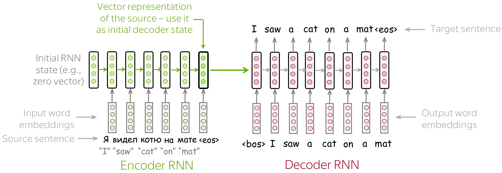
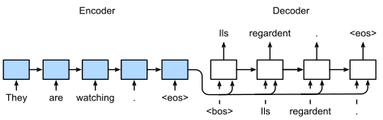
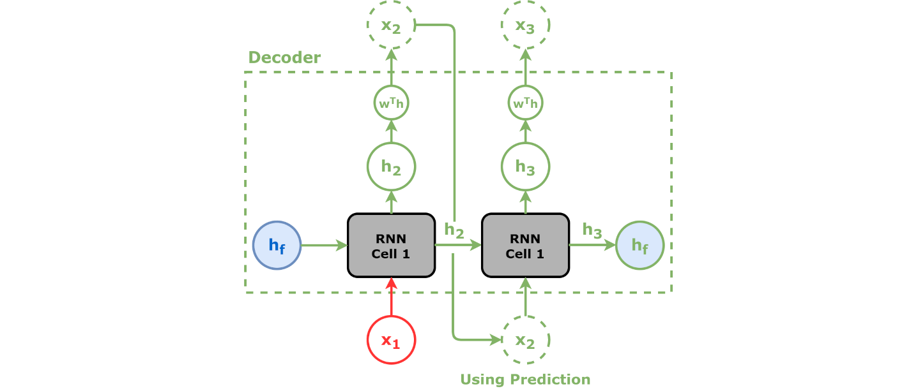

# Seq2Seq: Sequence-to-Sequence Learning

> **Core idea:** Learn a mapping from an input sequence $x_{1:m}$ to an output sequence $y_{1:n}$, where $m$ and $n$ may be different.  
> **Classic family:** RNN/LSTM encoder-decoder (with or without attention)  
> **Modern family:** Transformer encoder-decoder

---

## 1. Introduction / Overview

**Sequence-to-Sequence (Seq2Seq)** models solve **sequence transduction** problems:

- Input: a sequence (text, speech frames, events, code tokens, etc.)
- Output: another sequence (translation, summary, transcript, response, etc.)

Instead of predicting one label, Seq2Seq predicts a whole output sequence autoregressively.

Typical objective:

$$
y^* = \arg\max_y p(y\mid x)
$$

Factorization (chain rule):

$$
p(y\mid x) = \prod_{t=1}^{n} p(y_t\mid y_{<t}, x)
$$

Historically, early neural Seq2Seq used two LSTMs (encoder + decoder). The major early limitation was the fixed-size encoder bottleneck; attention mitigated this by letting the decoder focus on different source positions at each step.

---

## 2. Architecture

### 2.1 Encoder-Decoder (Basic)

1. **Encoder** reads source tokens $x_1,\dots,x_m$ and produces hidden states $h_1,\dots,h_m$.
2. **Decoder** starts from `<bos>` and generates one target token at a time.
3. Generation stops when `<eos>` is produced or a max length is reached.

In the simplest RNN/LSTM Seq2Seq, the decoder is initialized from the final encoder state.

### 2.2 Attention-Enhanced Seq2Seq

At decoding step $t$, attention computes a context vector $c_t$ as a weighted sum of encoder states:

$$
\alpha_{t,i} = \operatorname{softmax}(e_{t,i}), \quad
c_t = \sum_{i=1}^{m} \alpha_{t,i} h_i
$$

where $e_{t,i}$ is an alignment score between decoder state and encoder state $h_i$.

This removes the fixed-vector bottleneck and improves long-sequence handling.

### 2.3 Training vs Inference

- **Training (teacher forcing):** decoder input at step $t$ is the ground-truth token $y_{t-1}$.
- **Inference:** decoder input at step $t$ is the model's previous prediction.

This mismatch is often called **exposure bias**.

---

## 3. Images for Illustration

### 3.1 Simple RNN Encoder-Decoder



Source: Lena Voita NLP Course  
Original: https://lena-voita.github.io/nlp_course/seq2seq_and_attention.html

### 3.2 Training (Teacher Forcing)



Source: Wikimedia Commons (Seq2seq-training.svg)  
Original: https://commons.wikimedia.org/wiki/File:Seq2seq-training.svg

### 3.3 Prediction (Autoregressive Decoding)


Source: Wikimedia Commons (Seq2seq-predict.svg)  
Original: https://commons.wikimedia.org/wiki/File:Seq2seq-predict.svg

### 3.4 Decoder View



Source: Wikimedia Commons, author Daniel Voigt Godoy, CC BY 4.0  
Original: https://commons.wikimedia.org/wiki/File:Decoder_RNN.png

---

## 4. Math Formula Summary

Let source sequence be $x_{1:m}$ and target sequence be $y_{1:n}$.

### 4.1 Conditional sequence probability

$$
p(y\mid x) = \prod_{t=1}^{n} p(y_t\mid y_{<t}, x)
$$

### 4.2 Decoder token distribution

Given decoder hidden state $s_t$ and context $c_t$:

$$
o_t = W_o[s_t;c_t] + b_o,
\qquad
p(y_t\mid y_{<t},x)=\operatorname{softmax}(o_t)
$$

### 4.3 Attention (dot/general form)

$$
e_{t,i} = \operatorname{score}(s_{t-1}, h_i),
\qquad
\alpha_{t,i} = \frac{\exp(e_{t,i})}{\sum_{j=1}^{m}\exp(e_{t,j})}
$$

$$
c_t = \sum_{i=1}^{m} \alpha_{t,i}h_i
$$

### 4.4 Training loss (cross-entropy)

$$
\mathcal{L} = -\sum_{t=1}^{n} \log p(y_t^{\text{gold}}\mid y_{<t}^{\text{gold}},x)
$$

---

## 5. Inference: Greedy Decoding and Beam Search

At inference, exact search over all sequences is intractable.

### 5.1 Greedy Decoding

At each step:

$$
\hat{y}_t = \arg\max_{v\in V} p(v\mid \hat{y}_{<t},x)
$$

- Fast and simple
- Can miss globally better sequences

### 5.2 Beam Search

Maintain top-$B$ partial hypotheses by cumulative log-probability:

$$
\mathrm{score}(y_{1:t}) = \sum_{k=1}^{t}\log p(y_k\mid y_{<k},x)
$$

At each step:

1. Expand each beam with candidate next tokens.
2. Keep top-$B$ candidates by score.
3. Stop when enough hypotheses emit `<eos>` or max length is reached.

Beam search visualization:

<video controls width="720" preload="metadata">
	<source src="https://lena-voita.github.io/resources/lectures/seq2seq/general/beam_search.mp4" type="video/mp4">
	Your Markdown viewer does not support inline video. Open:
	https://lena-voita.github.io/resources/lectures/seq2seq/general/beam_search.mp4
</video>

Direct link: https://lena-voita.github.io/resources/lectures/seq2seq/general/beam_search.mp4

Common improvements:

- Length normalization (reduce short-sequence bias)
- Coverage or repetition penalties (task-dependent)

---

## 6. Sample PyTorch Code

Below is a compact educational implementation of an **LSTM Seq2Seq with dot attention**, including both greedy and beam decoding.

```python
import torch
import torch.nn as nn
import torch.nn.functional as F


class Encoder(nn.Module):
	def __init__(self, vocab_size: int, emb_dim: int, hidden_dim: int, pad_idx: int = 0):
		super().__init__()
		self.emb = nn.Embedding(vocab_size, emb_dim, padding_idx=pad_idx)
		self.rnn = nn.LSTM(emb_dim, hidden_dim, batch_first=True)

	def forward(self, src):
		# src: (B, S)
		x = self.emb(src)
		outputs, (h, c) = self.rnn(x)
		# outputs: (B, S, H), h/c: (1, B, H)
		return outputs, (h, c)


class DotAttention(nn.Module):
	def forward(self, dec_h, enc_out, mask=None):
		# dec_h: (B, H), enc_out: (B, S, H)
		scores = torch.bmm(enc_out, dec_h.unsqueeze(2)).squeeze(2)  # (B, S)
		if mask is not None:
			scores = scores.masked_fill(~mask, -1e9)
		attn = torch.softmax(scores, dim=-1)  # (B, S)
		ctx = torch.bmm(attn.unsqueeze(1), enc_out).squeeze(1)  # (B, H)
		return ctx, attn


class Decoder(nn.Module):
	def __init__(self, vocab_size: int, emb_dim: int, hidden_dim: int, pad_idx: int = 0):
		super().__init__()
		self.emb = nn.Embedding(vocab_size, emb_dim, padding_idx=pad_idx)
		self.rnn = nn.LSTM(emb_dim + hidden_dim, hidden_dim, batch_first=True)
		self.attn = DotAttention()
		self.proj = nn.Linear(hidden_dim * 2, vocab_size)

	def step(self, y_prev, state, enc_out, src_mask=None):
		# y_prev: (B,), state: (h, c) each (1, B, H)
		h, c = state
		dec_h = h[-1]  # (B, H)
		ctx, attn = self.attn(dec_h, enc_out, src_mask)

		y_emb = self.emb(y_prev).unsqueeze(1)  # (B, 1, E)
		rnn_in = torch.cat([y_emb, ctx.unsqueeze(1)], dim=-1)  # (B, 1, E+H)
		out, (h_new, c_new) = self.rnn(rnn_in, (h, c))

		out = out.squeeze(1)  # (B, H)
		logits = self.proj(torch.cat([out, ctx], dim=-1))  # (B, V)
		return logits, (h_new, c_new), attn


class Seq2Seq(nn.Module):
	def __init__(self, src_vocab: int, tgt_vocab: int, emb_dim: int = 128, hidden_dim: int = 256, pad_idx: int = 0):
		super().__init__()
		self.encoder = Encoder(src_vocab, emb_dim, hidden_dim, pad_idx)
		self.decoder = Decoder(tgt_vocab, emb_dim, hidden_dim, pad_idx)

	def forward(self, src, tgt_in, src_mask=None):
		# tgt_in excludes last token; teacher forcing with gold prefix
		enc_out, state = self.encoder(src)
		B, T = tgt_in.shape
		logits_all = []
		y_prev = tgt_in[:, 0]
		for t in range(T):
			logits, state, _ = self.decoder.step(y_prev, state, enc_out, src_mask)
			logits_all.append(logits.unsqueeze(1))
			if t + 1 < T:
				y_prev = tgt_in[:, t + 1]
		return torch.cat(logits_all, dim=1)  # (B, T, V)


@torch.no_grad()
def greedy_decode(model, src, bos_id: int, eos_id: int, max_len: int = 50, src_mask=None):
	model.eval()
	enc_out, state = model.encoder(src)
	B = src.size(0)
	y_prev = torch.full((B,), bos_id, dtype=torch.long, device=src.device)

	out_tokens = []
	for _ in range(max_len):
		logits, state, _ = model.decoder.step(y_prev, state, enc_out, src_mask)
		y_prev = logits.argmax(dim=-1)
		out_tokens.append(y_prev.unsqueeze(1))
	out = torch.cat(out_tokens, dim=1)
	return out


@torch.no_grad()
def beam_search_decode(model, src, bos_id: int, eos_id: int, beam_size: int = 4, max_len: int = 50):
	# Single-example beam search for clarity.
	assert src.size(0) == 1, "This simple beam search expects batch size 1"
	model.eval()

	enc_out, init_state = model.encoder(src)
	device = src.device

	beams = [([bos_id], 0.0, init_state)]  # (tokens, logprob, state)
	finished = []

	for _ in range(max_len):
		candidates = []
		for tokens, score, state in beams:
			last = tokens[-1]
			if last == eos_id:
				finished.append((tokens, score))
				continue

			y_prev = torch.tensor([last], dtype=torch.long, device=device)
			logits, next_state, _ = model.decoder.step(y_prev, state, enc_out)
			log_probs = F.log_softmax(logits, dim=-1).squeeze(0)
			topv, topi = torch.topk(log_probs, beam_size)

			for v, i in zip(topv.tolist(), topi.tolist()):
				candidates.append((tokens + [i], score + v, next_state))

		if not candidates:
			break

		candidates.sort(key=lambda x: x[1], reverse=True)
		beams = candidates[:beam_size]

		if all(toks[-1] == eos_id for toks, _, _ in beams):
			finished.extend([(toks, sc) for toks, sc, _ in beams])
			break

	if not finished:
		finished = [(toks, sc) for toks, sc, _ in beams]

	finished.sort(key=lambda x: x[1], reverse=True)
	return finished[0][0]


if __name__ == "__main__":
	torch.manual_seed(42)
	src_vocab, tgt_vocab = 1000, 1200
	model = Seq2Seq(src_vocab, tgt_vocab)

	src = torch.randint(2, src_vocab, (2, 12))
	tgt_in = torch.randint(2, tgt_vocab, (2, 10))

	logits = model(src, tgt_in)
	print("train logits:", logits.shape)  # (B, T, V)

	greedy = greedy_decode(model, src[:1], bos_id=1, eos_id=2, max_len=12)
	print("greedy shape:", greedy.shape)

	best = beam_search_decode(model, src[:1], bos_id=1, eos_id=2, beam_size=4, max_len=12)
	print("beam best tokens:", best)
```

---

## 7. Applications

Seq2Seq is broadly used in tasks where output is structured as a sequence:

- Machine translation
- Abstractive summarization
- Dialogue and response generation
- Speech recognition (sequence of acoustic frames -> sequence of tokens)
- Image captioning (image features -> text sequence)
- Code generation and code translation
- Grammatical error correction and text rewriting

---

## 8. Notes and References

- Wikipedia overview: https://en.wikipedia.org/wiki/Seq2seq
- Lena Voita NLP course: https://lena-voita.github.io/nlp_course/seq2seq_and_attention.html
- Classic paper (Sutskever et al., 2014): https://arxiv.org/abs/1409.3215
- Attention paper (Bahdanau et al., 2014): https://arxiv.org/abs/1409.0473

This document focuses on classical encoder-decoder Seq2Seq and practical decoding. Transformer can also be seen as a Seq2Seq model under the same conditional generation objective.
