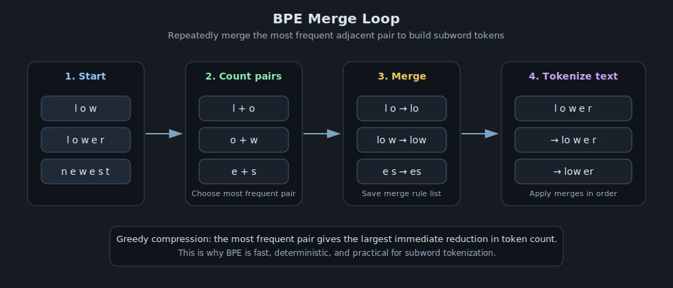

# Byte Pair Encoding (BPE)

> Core idea: start from characters, repeatedly merge the most frequent adjacent symbol pair, and build a compact subword vocabulary.
> Why it matters: BPE is one of the simplest and most widely used subword tokenization methods for modern language models.

---

## 1. Why Subword Tokenization Exists

Word-level tokenization has two problems:

- **Vocabulary explosion:** new words, names, and typos keep appearing.
- **Out-of-vocabulary tokens:** a word unseen during training can become unknown or awkwardly split.

Character-level tokenization avoids unknown words, but sequences become long and inefficient.

BPE sits in the middle: it learns frequent multi-character chunks that are larger than characters but smaller than full words.

---

## 2. What BPE Learns

BPE begins with a base vocabulary of characters, often including an end-of-word marker such as `</w>`.

From there, it repeatedly merges the most frequent adjacent pair.

Example initial symbol stream:

`l o w </w>, l o w e r </w>, n e w e s t </w>, w i d e s t </w>`

At each step, BPE finds the pair with the highest frequency across the corpus and adds the merged symbol to the vocabulary.

---

## 3. The Merge Rule

Suppose the pair $(a,b)$ appears $f(a,b)$ times in the current tokenized corpus.

If we merge it into a new symbol $ab$, then:

In words: each of the $f(a,b)$ occurrences of $(a,b)$ becomes a single $ab$ token.

This reduces the number of token boundaries wherever that pair occurred.

### Greedy objective

BPE is greedy: at each iteration it chooses the pair with maximum frequency.

That is not globally optimal in a strict information-theoretic sense, but it is simple, fast, and works very well in practice.

---

## 4. Why the Greedy Merge Makes Sense

If a pair appears frequently, then merging it usually saves many tokens across the corpus.

Let $c(a,b)$ be the pair count in the current corpus. One merge of $(a,b)$ into $ab$ reduces the total token count by exactly $c(a,b)$, because each occurrence of the pair removes one boundary between the two symbols.

So the greedy choice gives the largest immediate compression gain.

This is the core intuition behind BPE: frequent local patterns become single symbols.

---

## 5. Worked Example

Consider the toy corpus:

`low, lower, newest, widest`

After adding end markers, tokenize at the character level:

`l o w </w>`

`l o w e r </w>`

`n e w e s t </w>`

`w i d e s t </w>`

Now count adjacent pairs. If `l o` and `o w` are among the most frequent pairs, one possible merge sequence is:

1. `l + o -> lo`
2. `lo + w -> low`
3. `e + s -> es`
4. `es + t -> est`

After a few merges, the corpus begins to contain useful subwords like `low`, `est`, and so on.

The exact merge order depends on pair frequencies in the training corpus.

---

## 6. Algorithm

1. Start with a character vocabulary.
2. Count all adjacent symbol pairs in the corpus.
3. Merge the most frequent pair into a new symbol.
4. Update the corpus representation.
5. Repeat until the vocabulary reaches the target size.

In practice, the learned merge list is saved and reused during tokenization.

---

## 7. Tokenization at Inference Time

Training and inference use the same merge rules.

To tokenize a new word:

1. Start from characters.
2. Apply the learned merges in order.
3. Stop when no more merge rule applies.

This gives deterministic tokenization for any input string, including unseen words.

---

## 8. Relation to Other Subword Methods

| Method | Base unit | Main idea | Strength |
|---|---|---|---|
| Word-level | Words | Treat each word as a token | Simple but brittle |
| Character-level | Characters | No unknown words | Long sequences |
| BPE | Characters + frequent merges | Greedy compression of frequent pairs | Strong trade-off |
| WordPiece | Characters + learned likelihood objective | Select subwords that improve corpus likelihood | Often slightly more model-aware |
| Unigram LM | Candidate subwords | Optimize a probabilistic segmentation | Flexible and strong |

BPE is popular because it is simple, deterministic, and easy to implement efficiently.

---

## 9. Practical Strengths and Limitations

Strengths:

- handles rare and unseen words gracefully,
- shortens sequences compared with characters,
- simple to train and deploy,
- deterministic once merges are fixed.

Limitations:

- greedy merge decisions are local, not globally optimal,
- token boundaries can be awkward across languages or domains,
- byte-level variants can split text in unintuitive ways,
- very frequent subwords may still not align with linguistic morphemes.

---

## 10. Visual Intuition

---

## 11. One-Sentence Summary

BPE builds a subword vocabulary by greedily merging the most frequent adjacent symbol pairs, giving a compact and practical tokenization scheme for language models.
